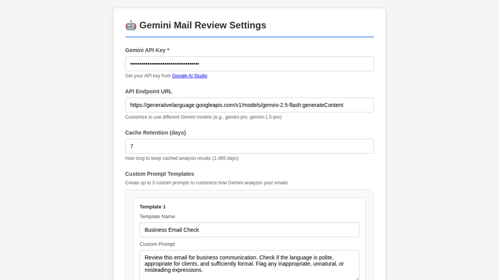
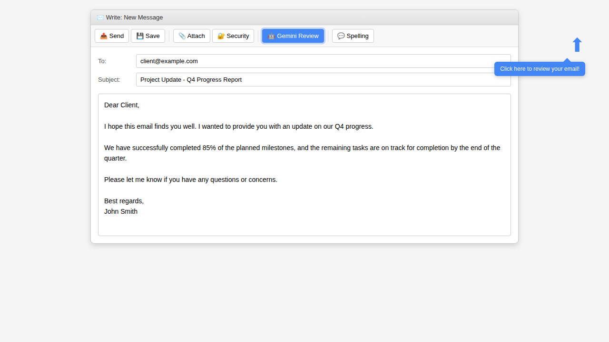
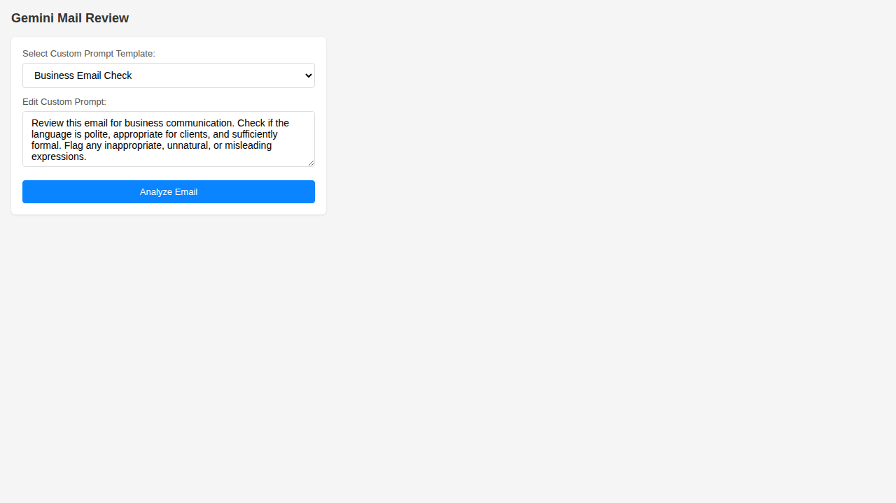
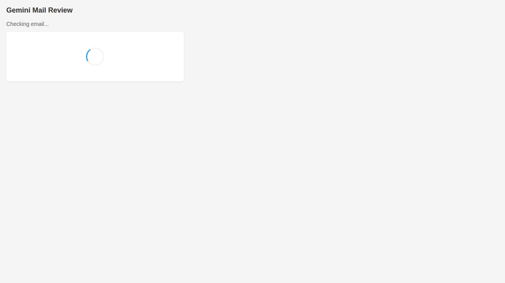
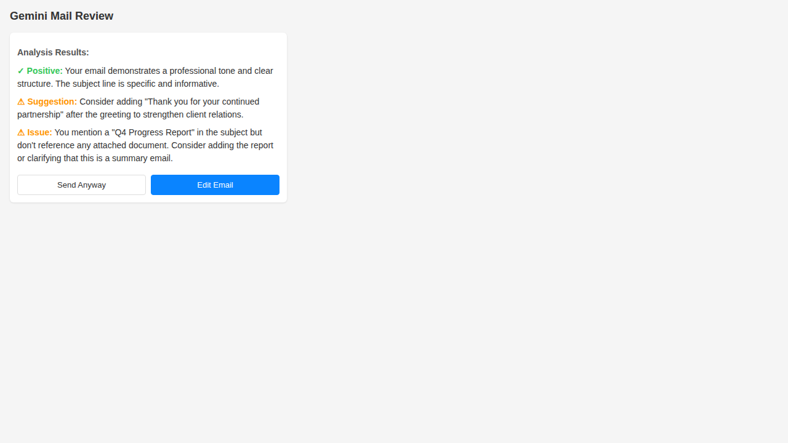
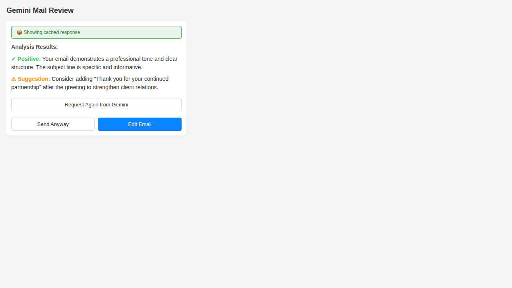
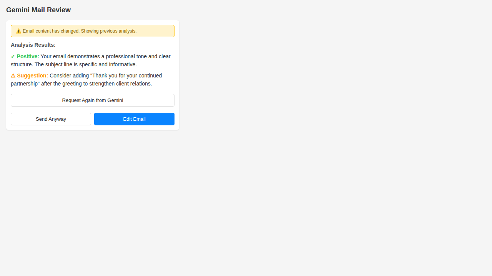

# Guida all'utilizzo

[English](USAGE.md) | [日本語](USAGE.ja.md) | [Deutsch](USAGE.de.md) | [Français](USAGE.fr.md) | [简体中文](USAGE.zh_CN.md) | Italiano

## Avvio rapido

1. **Installa l'estensione**
   - Installa l'estensione in Thunderbird (vedi README.md per le istruzioni di installazione)

2. **Configura la chiave API e l'endpoint**
   - Vai su **Strumenti** → **Componenti aggiuntivi e temi**
   - Trova **Gemini Mail Review** e clicca su **Preferenze**
   - Inserisci la tua chiave API Gemini
   - (Facoltativo) Personalizza l'URL dell'endpoint API per utilizzare un modello Gemini diverso
     - Predefinito: `https://generativelanguage.googleapis.com/v1/models/gemini-2.5-flash:generateContent`
     - Puoi cambiarlo per utilizzare altri modelli come `gemini-pro`, `gemini-1.5-pro`, ecc.
   - (Facoltativo) Aggiungi modelli di prompt personalizzato per personalizzare come Gemini analizza le tue email
     - Puoi salvare fino a 3 modelli di prompt personalizzato con nomi
     - Ogni modello può avere un nome descrittivo e istruzioni personalizzate
     - **Supporto multilingue**: Scrivi il tuo prompt personalizzato in qualsiasi lingua e Gemini risponderà nella stessa lingua
       - Prompt in italiano → Risultati dell'analisi in italiano
       - Prompt in inglese → Risultati dell'analisi in inglese
       - Prompt in giapponese (日本語) → Risultati dell'analisi in giapponese (日本語)
       - Funziona per qualsiasi lingua supportata da Gemini
     - Esempio per la verifica di email aziendali (italiano): "Rivedi questa email per la comunicazione aziendale. Controlla se il linguaggio è educato, appropriato per i clienti e sufficientemente formale. Segnala eventuali espressioni inappropriate, innaturali o fuorvianti."
     - Esempio per la verifica di email aziendali (inglese): "Review this email for business communication. Check if the language is polite, appropriate for clients, and sufficiently formal. Flag any inappropriate, unnatural, or misleading expressions."
   - Clicca su **Verifica connessione** per verificare la configurazione
   - Clicca su **Salva impostazioni**

   
   *Pagina delle impostazioni che mostra la configurazione della chiave API, i prompt personalizzati e altre opzioni*

3. **Componi un'email**
   - Crea una nuova email o rispondi a un'email esistente
   - Scrivi la tua email come di consueto

4. **Verifica prima di inviare**
   - Prima di cliccare su Invia, clicca sull'icona **Gemini Mail Review** nella barra degli strumenti della finestra di composizione
   
   
   *L'icona Gemini Mail Review nella barra degli strumenti della finestra di composizione di Thunderbird*
   
   - Il popup si apre con la selezione del modello:
     - Seleziona un modello di prompt personalizzato dal menu a discesa (se ne hai configurati)
     - Rivedi e modifica il prompt personalizzato se necessario
     - Clicca su **Analizza email** per avviare l'analisi
   
   
   *Popup che mostra la selezione del modello e l'editor del prompt personalizzato*
   
   - Attendi l'analisi dell'IA (di solito 2-5 secondi)
   
   
   *Analisi in corso*
   
   - Rivedi il feedback
   
   
   *Feedback e suggerimenti dell'IA visualizzati*

5. **Agisci sul feedback**
   - **Modifica email**: Chiudi il popup e apporta modifiche in base ai suggerimenti
   - **Invia comunque**: Chiudi il popup e procedi con l'invio (devi ancora cliccare sul pulsante Invia)

## Capire i risultati dalla cache

Quando analizzi la stessa email più volte, l'estensione utilizza una cache intelligente per risparmiare chiamate API e fornire feedback istantaneo.

### Risposta dalla cache
Quando rivedi un'email che hai già analizzato, vedrai un indicatore di risposta dalla cache:


*Risultato dell'analisi dalla cache mostrato istantaneamente con l'indicatore "📦 Showing cached response"*

### Avviso di contenuto modificato
Se modifichi la tua email dopo averla analizzata, la prossima verifica mostrerà l'analisi precedente con un avviso:


*Analisi precedente mostrata con l'avviso "⚠️ Email content has changed" e opzione per richiedere una nuova analisi*

Questo ti consente di:
- Vedere rapidamente il tuo feedback precedente
- Decidere se hai bisogno di una nuova analisi per le tue modifiche
- Cliccare su "Request Again from Gemini" se desideri una nuova analisi del contenuto aggiornato

## Esempi di casi d'uso

### Verifica degli errori grammaticali
**Scenario**: Non sei sicuro se la tua email contenga errori di battitura o grammaticali.

**Azione**: Clicca sul pulsante Gemini Mail Review. L'IA identificherà gli errori di ortografia e grammatica e suggerirà correzioni.

### Verifica del tono professionale
**Scenario**: Stai inviando un'email professionale importante e vuoi assicurarti che sembri professionale.

**Azione**: Usa la funzione di verifica per ottenere feedback sul tono e la professionalità. L'IA ti dirà se il tono è appropriato o se sono necessarie modifiche.

### Rilevamento di allegati mancanti
**Scenario**: Hai menzionato "vedi in allegato" nella tua email ma hai dimenticato di allegare il file.

**Azione**: L'IA può rilevare quando fai riferimento ad allegati e avvisarti se nessuno è allegato (nota: richiede che il contenuto dell'email menzioni gli allegati).

### Verifica della chiarezza
**Scenario**: Hai scritto un'email complessa e vuoi assicurarti che sia chiara.

**Azione**: La verifica identificherà le sezioni poco chiare e suggerirà modi per migliorare la chiarezza e la concisione.

### Verifica di email multilingue
**Scenario**: Scrivi email in lingue diverse dall'italiano e vuoi un'analisi nella tua lingua madre.

**Azione**: Crea un modello di prompt personalizzato nella tua lingua preferita. L'IA analizzerà la tua email e fornirà feedback in quella stessa lingua. Ad esempio:
- Scrivi il tuo prompt personalizzato in italiano → Ottieni risultati dell'analisi in italiano
- Scrivi il tuo prompt personalizzato in inglese → Ottieni risultati dell'analisi in inglese
- Scrivi il tuo prompt personalizzato in giapponese → Ottieni risultati dell'analisi in giapponese

**Esempi di prompt personalizzati per lingua**:

**Italiano**:
```
Analizza questa email e verifica:
- Grammatica e ortografia
- Tono professionale
- Chiarezza del messaggio
- Potenziali problemi
Fornisci commenti e suggerimenti in italiano.
```

**Inglese (English)**:
```
Review this email and check:
- Grammar and spelling
- Professional tone
- Message clarity
- Potential issues
Provide feedback and suggestions in English.
```

**Giapponese (日本語)**:
```
このメールを分析して、以下の点を確認してください：
- 文法とスペルミス
- 敬語の適切な使用
- ビジネスメールとしての適切さ
- 言い回しの自然さ
問題点があれば、理由と修正案を日本語で提示してください。
```

## Capire i risultati della verifica

L'analisi dell'IA include tipicamente:

- **✓ Feedback positivo**: Cosa funziona bene nella tua email
- **⚠️ Avvisi**: Cose che potrebbero essere preoccupanti ma non necessariamente errori
- **❌ Problemi**: Problemi che dovrebbero essere risolti prima dell'invio
- **💡 Suggerimenti**: Raccomandazioni specifiche per il miglioramento

## Consigli per risultati migliori

1. **Scrivi prima, verifica dopo**: Completa la tua email prima di eseguire la verifica per ottenere feedback più completo
2. **Usa oggetti descrittivi**: Includi un oggetto per una migliore analisi contestuale
3. **Verifica regolarmente**: Prendi l'abitudine di verificare le email importanti prima di inviarle
4. **Non affidarti troppo**: Usa l'IA come assistente utile, non come sostituto del tuo giudizio
5. **Consapevolezza della privacy**: Ricorda che la tua email viene inviata all'API di Google per l'analisi

## Risoluzione dei problemi

### Nessun risultato di analisi
- Controlla la tua connessione Internet
- Verifica che la tua chiave API sia configurata correttamente
- Assicurati di non aver superato i limiti di frequenza dell'API

### Risposta lenta
- Le email più grandi richiedono più tempo per essere analizzate
- I tempi di risposta dell'API possono variare in base al carico del server
- Considera di verificare le sezioni separatamente per le email molto lunghe

### Suggerimenti imprecisi
- L'IA è utile ma non perfetta
- Usa il tuo giudizio quando valuti i suggerimenti
- Il contesto è importante - conosci il tuo destinatario meglio dell'IA

### Problemi con la chiave API
- Assicurati che la tua chiave API sia valida e attiva
- Verifica di non aver superato la tua quota
- Genera una nuova chiave se quella vecchia non funziona

## Privacy e sicurezza

- **Cosa viene inviato**: Oggetto, destinatari e corpo dell'email
- **Cosa non viene inviato**: Allegati, la tua chiave API (tranne a Google)
- **Archiviazione dei dati**: La tua chiave API è memorizzata localmente in Thunderbird
- **Trasmissione dei dati**: Inviata in modo sicuro tramite HTTPS all'API Gemini di Google
- **Conservazione**: Consulta l'informativa sulla privacy di Google per sapere come gestiscono i dati dell'API

## Utilizzo e limiti dell'API

Il piano gratuito dell'API Gemini di Google include:
- 60 richieste al minuto
- Sufficiente per un utilizzo tipico delle email

Se superi i limiti:
- Vedrai un messaggio di errore
- Attendi un minuto prima di riprovare
- Considera di aggiornare il tuo piano API se necessario

## Best practice

1. **Verifica pre-invio**: Verifica sempre prima di inviare email importanti
2. **Verifiche multiple**: Se apporti modifiche significative dopo una verifica, verifica di nuovo
3. **Impara dal feedback**: Presta attenzione ai problemi comuni che l'IA identifica nella tua scrittura
4. **Combina con la revisione manuale**: Usa la verifica dell'IA in aggiunta alla tua revisione personale
5. **Consapevolezza del contesto**: Aggiungi contesto nella tua email se necessario per una migliore analisi

## Richieste di funzionalità e feedback

Se hai suggerimenti o trovi problemi, segnalali nel repository GitHub del progetto.
